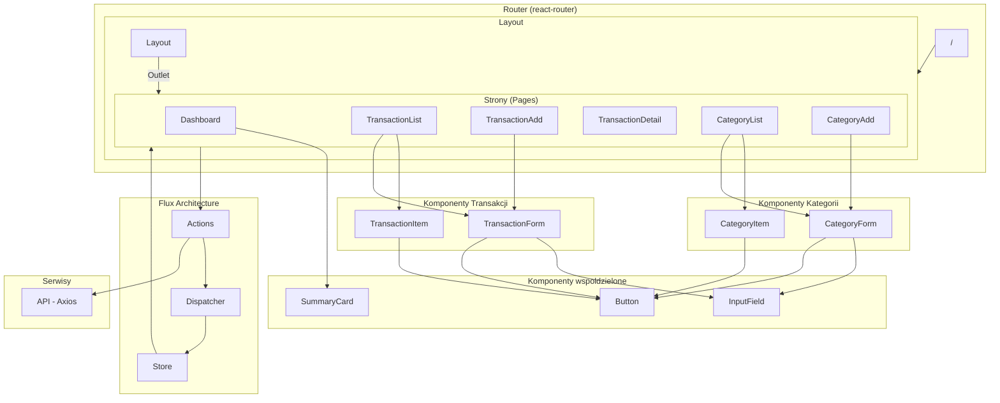
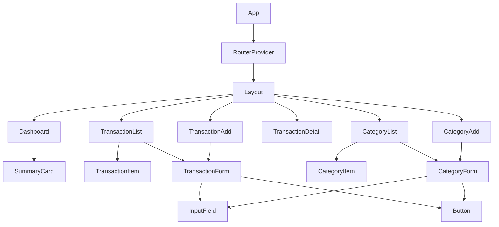
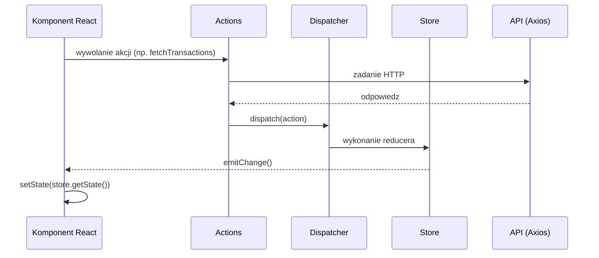
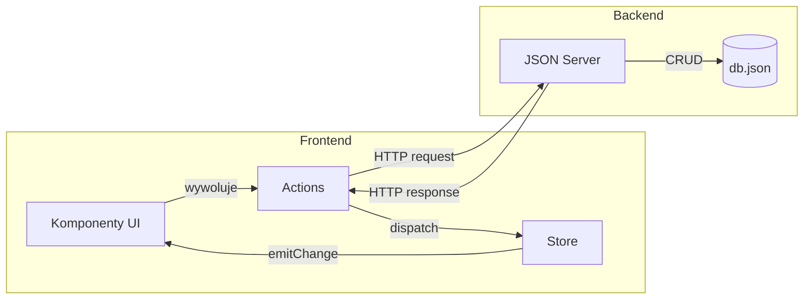

# Architektura Komponentow - Home Budget

Szczegolowa dokumentacja funkcjonalnosci, API, walidacji i komponentow znajduje sie w pliku FEATURES.md

---

## Diagram architektury komponentow



---

## Hierarchia komponentow



---

## Architektura Flux



---

## Przeplyw danych



---

## Struktura katalogow

```
src/
├── components/           # Komponenty wielokrotnego uzytku
│   ├── Button.tsx
│   ├── InputField.tsx
│   ├── SummaryCard.tsx
│   ├── categories/
│   │   ├── CategoryForm.tsx
│   │   └── CategoryItem.tsx
│   └── transactions/
│       ├── TransactionForm.tsx
│       └── TransactionItem.tsx
├── flux/                 # Architektura Flux
│   ├── actions.ts
│   ├── Dispatcher.ts
│   └── Store.ts
├── layout/
│   └── Layout.tsx
├── pages/
│   ├── CategoryAdd.tsx
│   ├── CategoryList.tsx
│   ├── Dashboard.tsx
│   ├── TransactionAdd.tsx
│   ├── TransactionDetail.tsx
│   └── TransactionList.tsx
├── services/
│   └── Api.ts
├── App.css
├── main.tsx
└── router.tsx
```
